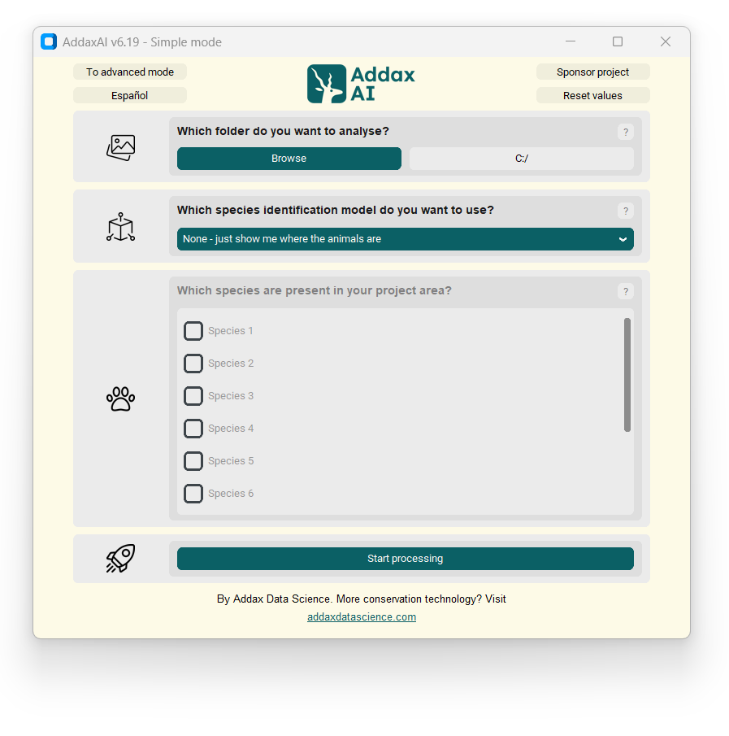
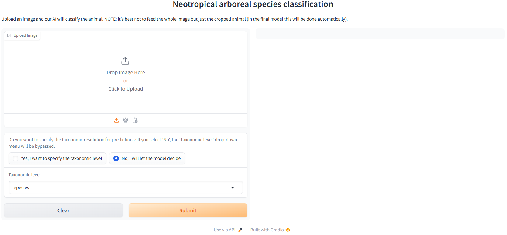

# 🌴 **TropiCam-AI**  

  

Advancing Arboreal Wildlife Monitoring in the Neotropics

---

</div

Surveying arboreal wildlife in tropical rainforests has long been a challenging endeavor. **TropiCam-AI** is the first machine learning-based solution specifically designed to automate the classification of Neotropical arboreal mammals and birds from camera-trap images and videos. It was released with the publication "**Introducing TropiCam-AI: A taxonomically flexible automated classifier of Neotropical arboreal mammals and birds from camera-trap data**" in _Methods in Ecology and Evolution_ (https://besjournals.onlinelibrary.wiley.com/doi/10.1111/2041-210x.70213).

Built on a ConvNeXt architecture and trained on both an extensive camera-trapping dataset and citizen-science images (which can be found on our [Zenodo](https://zenodo.org/) repository), TropiCam-AI can recognize a 84 taxa of arboreal mammals and birds (see [here](https://github.com/andrewzamp/TropiCam-AI/blob/main/taxonomy/taxonomy_mapping.csv) the full list), and it is optimized with a taxonomic aggregation strategy to return classification at multiple levels of the taxonomy hierarchy (e.g. species, genus, family, class and order) to enhance accuracy, flexibility and generalizability to unseen locations and species. TropiCam-AI aims to provide accuracy, flexibility, and ease of use for researchers and conservationists working to preserve biodiversity in one of the world's most biodiverse regions.  

---

## How to use it? 
### AddaxAI  
We wanted to make **TropiCam-AI** as easy to use as possible, without needing extensive knowledge on how machine learning algorithms work or coding/programming skills. So, our model is available on the  [**AddaxAI**](https://addaxdatascience.com/addaxai/) platform, a user-friendly and code-free application that allows deployment of machine learning classifiers with the simple click of a button. User can directly install AddaxAI from the official website, and then select our model (_Neotropical Region - TropiCam-AI 1.0_) from the zoo of available algorithms. After classification is finished, results can be made available in a number of different formats: among the most relevant, we highlight CSV/XLSX for direct integration in subsequent analyses, or the default JSON file that can be integrated in the popular [**Timelapse**](https://timelapse.ucalgary.ca/) software for image visualization. 

A **few tips**:
- TropiCam-AI can be used the classic way, forcing detected animals to be classified as one of the 84 taxa we used to train it (see see [here](https://github.com/andrewzamp/TropiCam-AI/blob/main/taxonomy/taxonomy_mapping.csv) the full list). However, the AddaxAI platform also provides a **taxonomic aggregation** feature, where if an animal is identified with low certainty, classification is returned at the higher taxonomic level (e.g. from species to genus). The model keeps iterating this procedure until it reaches the required confidence: this allows TropiCam-AI to still provide useful information instead of forcing classification at the species level under challenging scenarios.
- We set the aggregation threshold at **0.75** by default, which means that every classification with confidence value lower than 0.75 will be aggregated at a higher taxonomy. This value was determined empirically to maximize accuracy and taxonomic resolution, and we provide more details in our publication. However, we encourage users to experiment based on their needs: a lower threshold means that the model will return more classifications at species level, even the most uncertain ones; a higher threshold will result in a more fleible approach, where difficult images will be classified at a higher taxonomy more often.
- The AddaxAI platform also provides a number of post-inference utilities (manually annotate results, separating images in folders based on classification output, exporting classification results in CSV or XLSX, prodicing plots, and others). We refer to the [official website](https://addaxdatascience.com/addaxai/) and [GitHub repository](https://github.com/PetervanLunteren/AddaxAI) for more information.

 

### Single-image demo 
We also provide a very simple Gradio [demo](https://huggingface.co/spaces/andrewzamp/TropiCam-AI-demo), that can be used to test TropiCam-AI on single images on the cloud. Note: images uploaded to the demo are used only for inference and are NOT retained, temporarily or permanently, by us or the Gradio platform.

 

---

## How to cite us
Usage of either the TropiCam-AI model or any data associated to it (e.g. training images) must properly cite the original work in which TropiCam-AI was described and released:

- Zampetti, A., Santini, L., Ferreiro-Arias, I., Paltrinieri, L., Ortiz, I., Cedeño-Panchez, B.A., Baltzinger, C., Beirne, C., Bowler, M., Forget, P.M.,  Guilbert, E., Kemp, Y.J.M., Peres, C.A., Scabin, A.B., Whitworth, A., & Benítez-López, A. (2025). Introducing TropiCam-AI: A taxonomically flexible automated classifier of Neotropical arboreal mammals and birds from camera-trap data. _Methods in Ecology and Evolution_. https://doi.org/10.1111/2041-210x.70213
